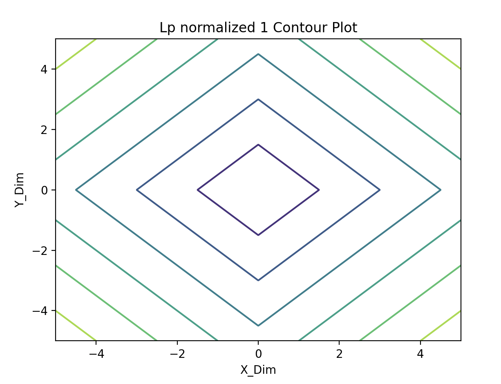

Homework 4 ReadMe

Question 3

Part 4: Calculate Values
For this part, I simply coded what I discovered in part 3, which utilized the collection of parts 1 and 2. After finding all the derivations, I was able to find the formulas for calculating weight and sigmoid, which ultimately were used to find the desired values for weight and sigmoid. The values are down below

a) The value(s) of s0 is: [0.94784644 0.88079708 0.80218389 0.52497919]
b) The value(w) of w1 is: [ 1.32465198  3.04991697 -6.82910388]
c) The value(s) of s1 is: [0.94737826 0.97455097 0.03124556 0.10437391]
d) The value(w) of w2 is: [ 1.36602464  4.15753654 -9.19961627]

Question 4
Note: Set the random seed to be 7, my favorite number
Note2: Used the same Kaggle function given from homework 1

Part 2: Batch Gradient Descent

Utilizing the knowledge from questions 2 and 3, I was able to use the theory of the BGD and code it from scratch. Based on the code I was able to create, I found the following data about the validation accuracy and the plot of the error.

Validation Accuracy =  0.994
p2 graph: 

The visuals matched the eye test as I was looking for the data to plateu at a low training error for the cost function and for the validation accuracy to be higher than 93% based on the Kaggle Submission

Part 4: Stochastic Gradient Descent

While the set up for the Design matrix and the weight are similar, the derivation of the Stochastic Gradient Descent was found for me slightly different to BGD. SGD picks random points and updates the weights based on it while BGD looks at it as a whole. With this discrepancy, I kept the code for SGD largely similar to the BGD and found the following results.

Validation Accuracy =  0.97875
p4 graph: 

The visuals matched the eye test as I was looking for the data to plateu at a low training error for the cost function and for the validation accuracy to be higher than 93% based on the Kaggle Submission

When comparing the two graphs, I found that Batch Gradient Descent converges to a lower training loss than Stochastic Gradient Descent. This is also numerically provable through the validation accuracy of the two gradient descent methods. The validation accuracy for BGD ~ 0.994 and for SGD ~ 0.97875. In total, both the visual graph and the numerical accuracy proves this statement. 

Part 5: Stochastic Decay vs Fixed

Similarily to Stochastic GD, I used the same class for the decay portion however, creating a different means to fit by instead of using the fixed learning rate, utilized a decaying learning rate defined by the question. After empirical tuning, I found that 0.001 was a strong example to use that demonstrated a key discrepancy between fixed and decaying rates. Primarily, through a visual analysis of the graphs, I found that the decay SGD seemed to plateu at a lower training error than the fixed learning rate. This is additionally reinforced numerically through the validation accuracy comparisons, with Decay being at ~ 0.99025 >> 0.97875 for the fixed learning rates. However, the convergence of the plots showed that the fixed learning rates converged faster and this is due to the nature of how these two methods are implemented with decay rates being updated while the learning rate being fixed. 

p4: Validation Accuracy =  0.97875
p5: Validation Accuracy with Learning Rate Decay = 0.99025
p5 graph v p4 graph: 

Part 6: Kaggle
For the Kaggle Submission, I ultimately decided that the Batch Gradient Descent was the most effective means to accomplish test predictions. The reason why is again stated in part 4 where I compared stochastic and batch gradient descents and their corresponding validation accuracies and graphulated error. 

Formally: When comparing the two graphs, I found that Batch Gradient Descent converges to a lower training loss than Stochastic Gradient Descent. This is also numerically provable through the validation accuracy of the two gradient descent methods. The validation accuracy for BGD ~ 0.994 and for SGD ~ 0.97875. In total, both the visual graph and the numerical accuracy proves this statement. 

Kaggle Submission View: 
user: dankimchi0430
Image: 

Question 6: Regularization + Sparisty
Given the lp norm equation, I simply coded this through the function l_p_norm and built a grid in the X and Y direction. For each contour plot, the Z dimension would dictate the shapes of the contours through the value of p asked for each part.

pa: 
pb: 
pc: 