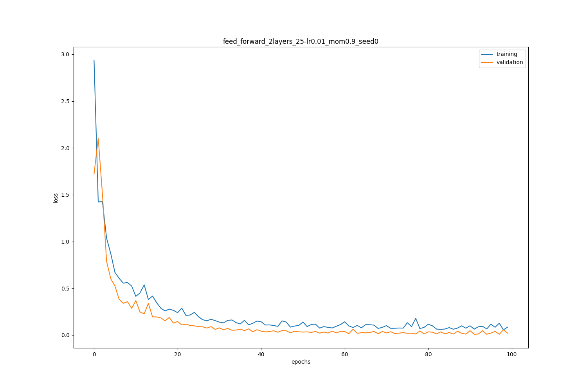
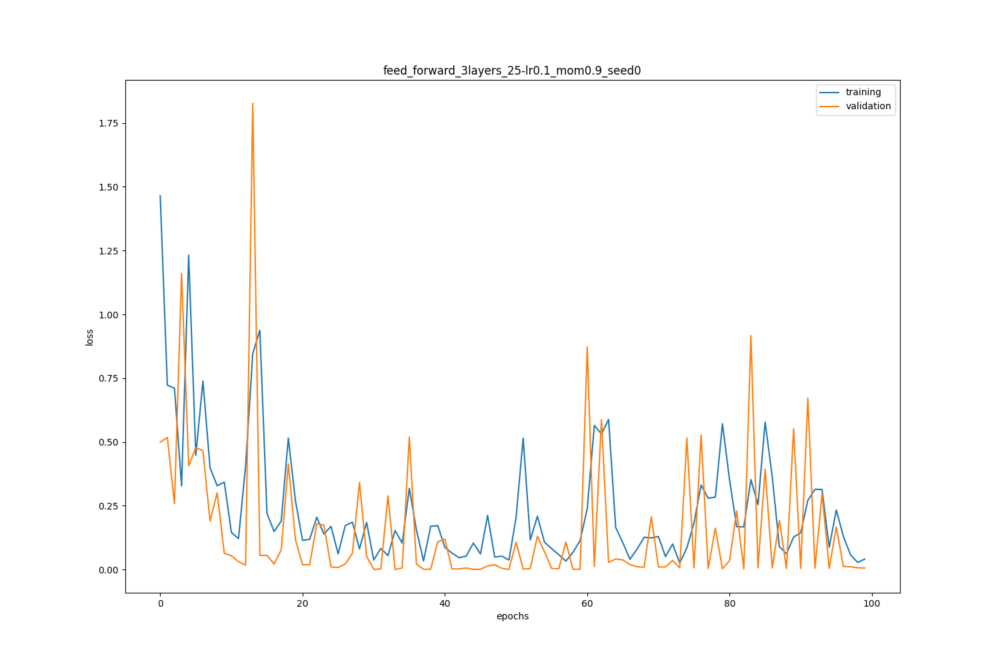
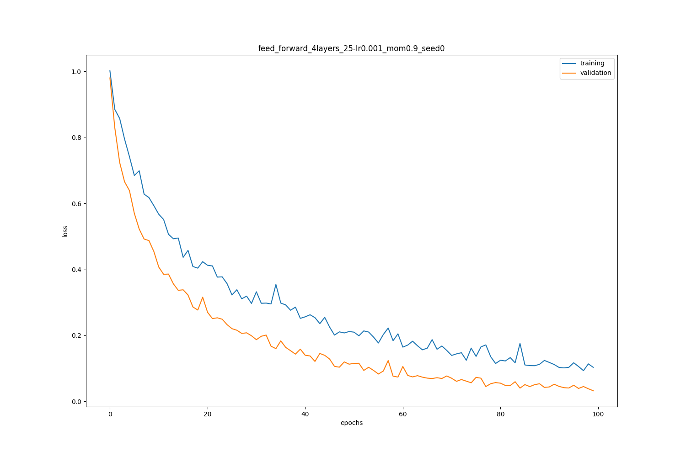
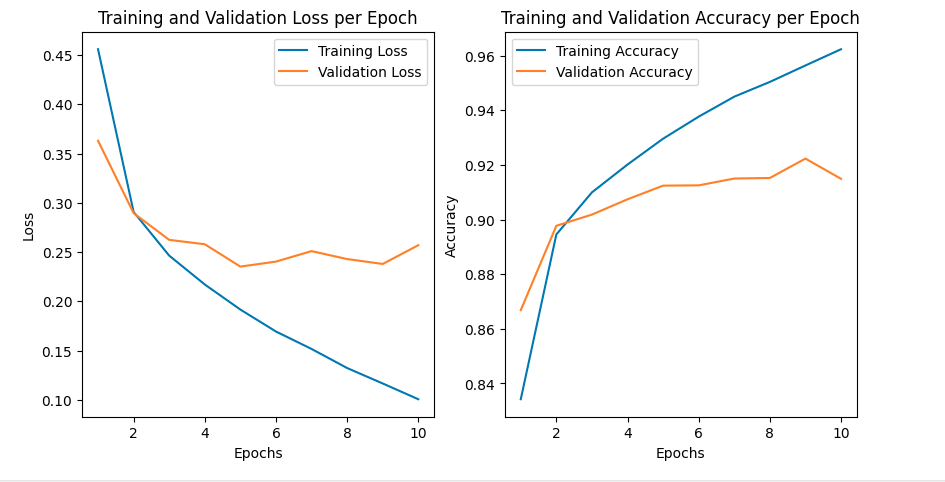
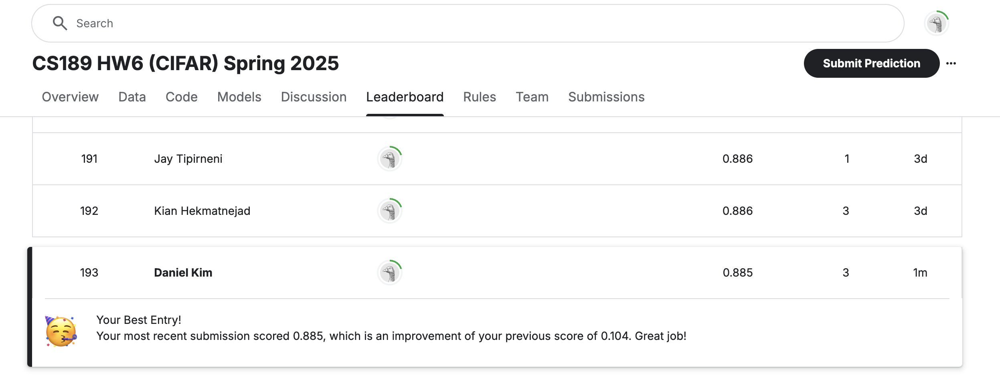
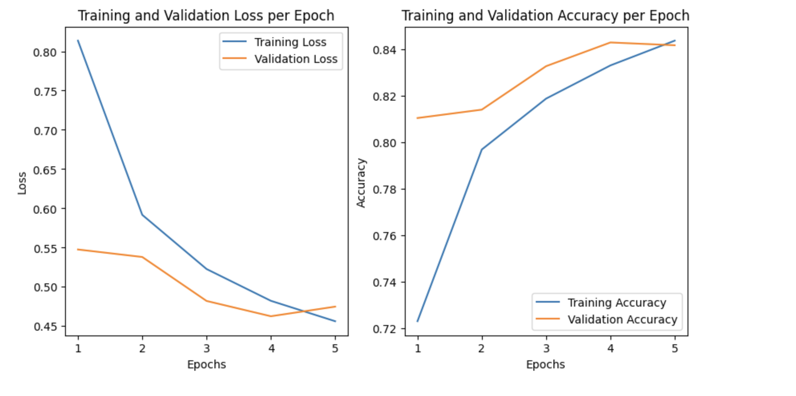
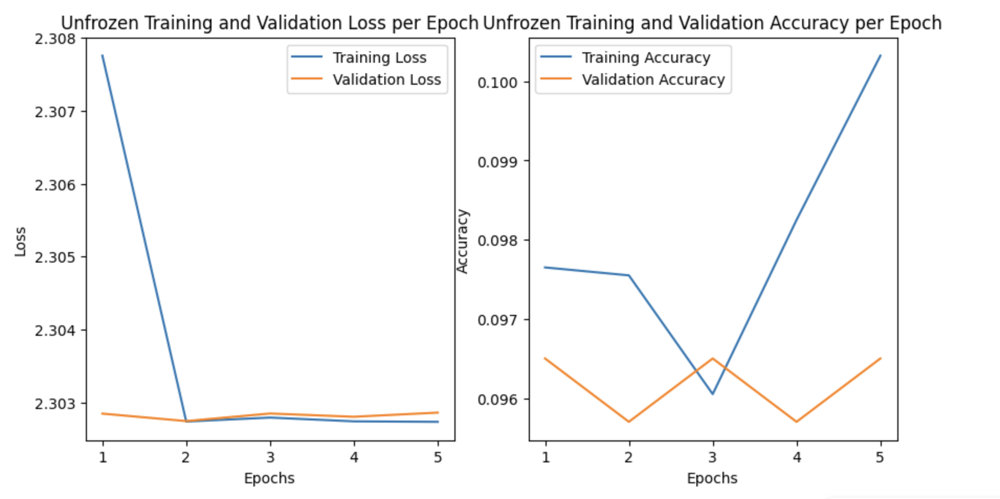

HW 6 Read Me: Daniel Kim 3035781657

Question 4: Basic Network Layers

4.1 ReLU
Forward: 
The forward method computes the output of the layer given an input, pusing the data toward making a prouct. 

The inherent definition of the ReLU is for the program to pick the max of the inputs and 0 otherwise

Backward:
The backward method computes how changes in weights, biases and inputs affect the loss enabling the model to update these parameters, utilizing the chain rule to propogate gradients backwards.

I used the definition of gradients where if the gradient is a negative number, that means that we would like the min the value for backprop to 0 wheras keep the values that are found with a gradient above 0 or a positive slope.

4.2 Fully Connected Layer
_init_parameters_:
Preperation for the layer for training by setting up the weights and biases. This function allows the nueron initial weights to shift as a result of the inputs and the biases. Weight initialization affects the Networks ability to train. Additionally, this function is needed so that the layer knows how many parameters to learn.

Forward: 
Fully connected means all output neuron recieves input from every input feature with its own learned weight. The activation function allows non-linearity, ultimately letting the model learn more complex relationships

Backward: 
Since all neurons are connected, they depend on all inputs meaning the gradient must be computed for every connection. The backward flow allows every neuron to update its contribution to the final prediction correctly.

4.3 Softmax Activation
Forward: 
Applies the softmax function to input Z which uses a numerical play of subtracting the max of every row in a batch before exponentiating, producing outputs of probabilities between 0 and 1. This makes the probabilities suitable for interpretation for predictions and is the last activation in a multiclass network.

Backward: 
Computes the Gradient of the loss with respect to the input Z and uses a simplified form instead of constructing the Jacobian matrix of the softmax. The output dZ represents how small changes in the input Z affect the Loss. Backpropagation through Softmax ensures the network learns correct relative comparisons between class scores.

4.4 Cross Entropy Loss
Forward: 
Calculates the cross-entropy loss between the true label and predicted probability. The idea is to take the negative log likelihood of the correct class and average it. It heavily penalizes wrong predictions encouraging the model to output high probability for the correct class.

Backward: 
Computes the Gradient of the loss with respect to the predictions Y_hat. The gradient is normalized by dividing by the batch size. The purpose is to compute how the loss would change if we slightly adjusted the predicted probabilities. Since the loss depends on the Y_hat, the gradient shows how to shift probabilities towards better matches. 

4.5 Batch Normalization Layers
_init_parameters_::
Created a learnable scaling in gamma and shifting parameter in beta. Additionally, the running mean and variance and setting up the gradients for gamma and beta occured during this setup period. Batch Normalization stabilizes learning by ensureing the activations have consistent distributions across batches making training faster. 

Forward: 
2 Modes

1) Training: While training, Batch Normalization computes batch means and variances, normalizes the inputs, scale and shift and update the running averages. 

2) Testing: while testing, use the running averages found during training to normalize inputs and cache the intermediate values which are needed for backpropogation

In total, Batch Normalization improves the optimization by smoothing the loss and allowing higher learning rates and faster congerence. Normalization reduces the interal shift which is the primary problem of the distributinos of inputs to each layer changing during training. The usage of running averages allows consistent behavior during testing.

Backward: 
(Optional)

Question 5: Two-Layer Fully Connected Networks:
3 Class Classification w 4 input features

I trained the model utilizing three different combinations of the hyperparameters: learning rate and hidden layer size. Below are the combinations of the learning rate and hidden layer size I used to help me come to a conclusion about the most effective route:

Loss Graphs and Corresponding Learning rates and Layers:
Model 1: Base Run(lr = 0.01, fc = 1): Test Loss: 0.3021 Test Accuracy: 0.88
Graph: 

Model 2: Run 2(lr = 0.1, fc = 2): Test Loss: 0.1251 Test Accuracy: 0.96
Graph: 

Model 3: Run 3(lr = 0.001, fc = 3): Test Loss: 0.1092 Test Accuracy: 0.96
Graph: 

From the results above, I found some intresting results. First, the Model 1 had a very smooth decreasing loss with both validation and training curves dropping and stabilitzing. This suggests good generalization and proper learning rate. Model 2 was perhaps the worst graphed loss possible. The graph had a loss curve that was jagged and unstable. Model 3 had intresting results, with more layers than Model 1 and a lower learning rate. The learning curves were smooth and had a slower convergence. In terms of test loss, we can see that Model 3 produced the lowest test loss and the highest test accuracy, leading me to believe that adding more layers and decreasing learning rate yields the best results. However, its worth noting that the bast model had the best balance of speed and accuracy.

Question 6: CNN Layers

6.1 Einsum Function
Expoloring the np.einsum function and comparing its results to np operations for all three linear algebra tasks.

Results:
6.1.1: Trace
Trace using np.trace: 1.9766222243316558
Trace using np.einsum: 1.9766222243316558
Norm of difference: 0.0

6.1.2: Matrix Product
Norm of difference: 2.5438405243138006e-16

6.1.3: Batchwise Matrix Product
Norm of difference: 5.3533015581491455e-16

Based on the results, we can see that the norms are essentially 0, confirming that np.einsum provides accurate results.

6.2 Convolutional Layer
Forward: 
The forward function pads the input and computes the convolution using a 4 looped nested structure where I looped over the batch, spatial locations(i, j) and output channels and applying the activation function to the results. While backward wasn't required, I made sure to store important values to the cache. Essentially, the forward function computes the output features map by sliding learned filters over the spatial dimensions of the input.  Since each feature is convolved with the image patch, this is the dot product between the kernel and slice of input volume. The resulting feature maps capture spatial structure. With this, the model learns the hierarchical features across the image.

Backward: Optional

6.3 Pooling Layers
Backpropogation through Max/Avg pooling
To compute the gradient through pooling layers using backpropagation, applying chain rule just like any layer but since pooling involves non-learnable operations with no weights/bias, we can only pass the gradient backwards to the relevant input pixels based on the pooling

1) avg pooling: each output is the average of a small patch of the input so during backprop, the gradient flowing from the output is evenly divided amongst the input values of the patch. 

2) max poosing: each output is the max of the patch so during backprop, tje location of the max value in each pooling window must be cached during the forward pass with the kernel shape, stride and padding aligning patches with output positions.

Forward:
the forward function for pooling slides a pooling window across the input and applies either max or average operations on the window. The pooling layers summarize features locallly keeping the important part the max or the smoothing average. After convolutional layers, pooling shrinks the representation while highlighting the key features

Backward:
the backward function computes how the output loss fradient flows back through the pooling operation. In average pooling, the gradient is split evenly across all inputs while in max pooling, the gradient flows only through the input with the max. Backprop through pooling must correctly assign responsibility for losss reduction.

6.4 Convolutional Neural Network
Optional

Question 7: Pytorch

7.1 CNN for Fashion MNIST
Code Located in: cs189_hw6_nn_mnist
Plot: 

In the plot contains the Training and Validation loss along with the Training and Validation accuracy for the MNIST Dataset

7.2 Transfer Learning for CIFAR-10

Kaggle Submission:

Analysis: Frozen and UnFrozen
Frozen:
I used a pretrained Alexnet with frozen convolutional layers and replaced the claswsifier with a 3-layer. The training was conducted by an Adam optimizer learning rate of 0.001 for 5 epochs to prevent overfitting and a 80-20 training-validation split. The final model had 41958410 trainable parameters.

Frozen Plot: 
num_trainable_parameters(Frozen) = 41958410

Unfrozen: 
I made a different model with everything the same as the Frozen model except that I unfroze all the convolutional layers. Again, used an Adam optimizer learning rate of 0.001 for 5 epochs to prevent overfitting and a 80-20 training-validation split. Based on the graphs, the Unfrozen graph demonstrated a more robust training/validation loss and accuracy in comparison to the frozen however the fine tuning of the convolutional layers did allow the model to see slightly higher validation accuracy but at the cost of longer time.

UnFrozen Plot: 
num_trainable_parameters(UnFrozen) = 44428106