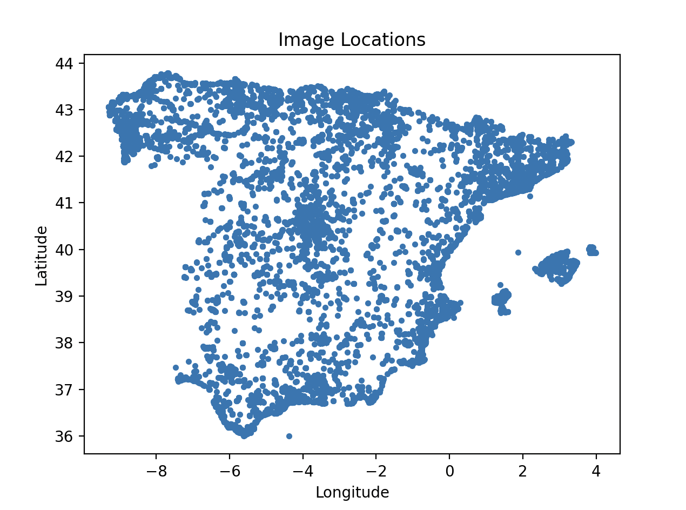
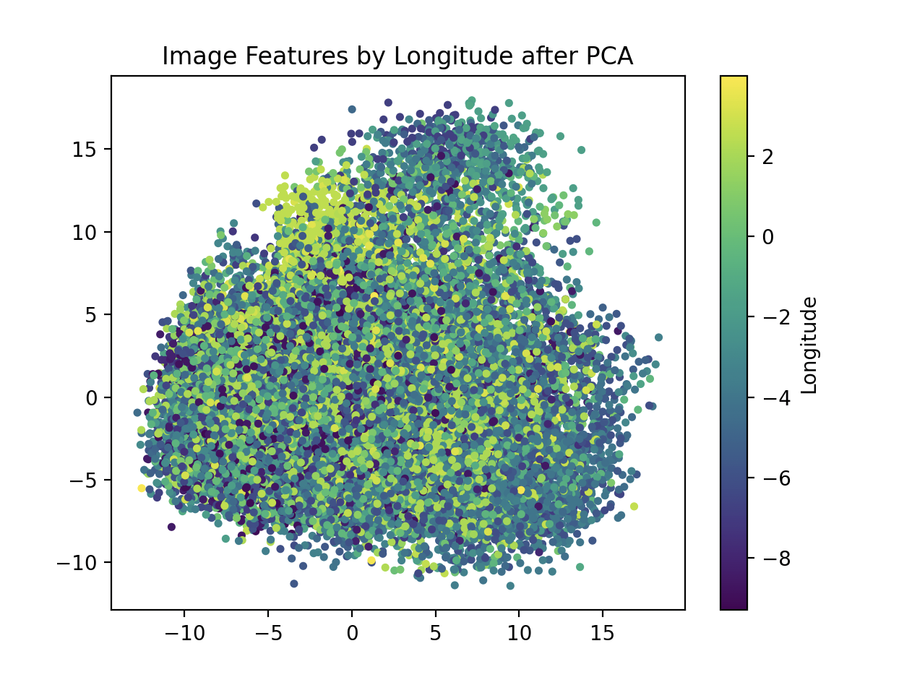
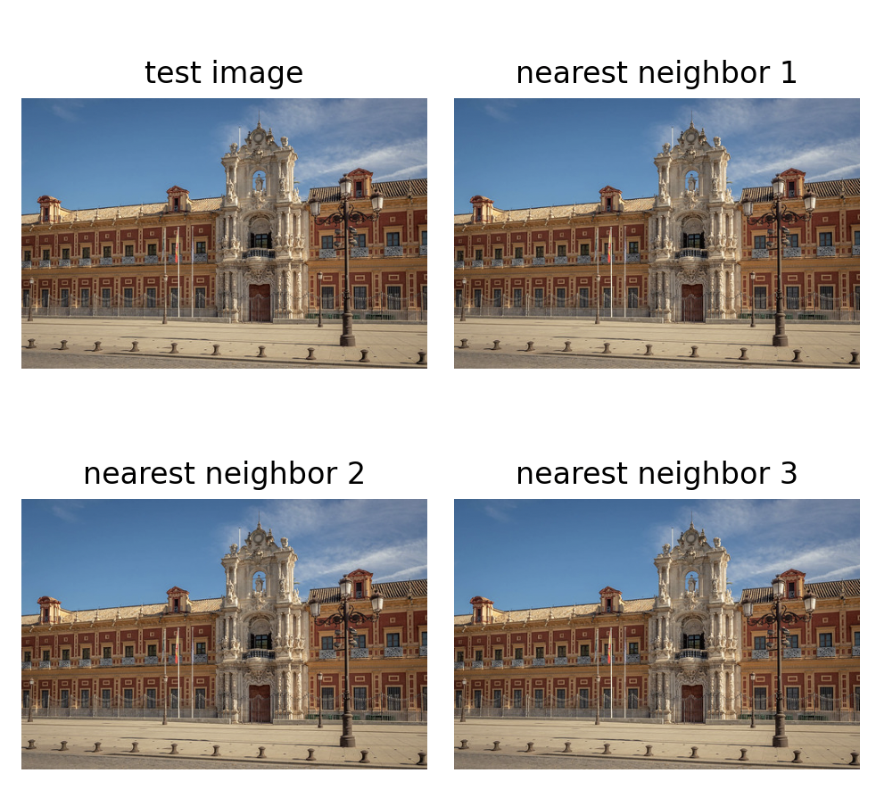
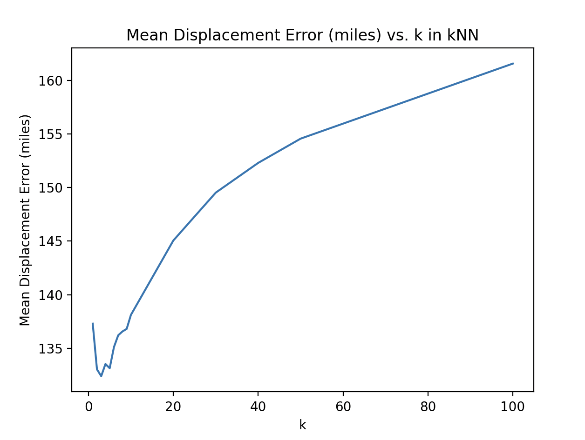
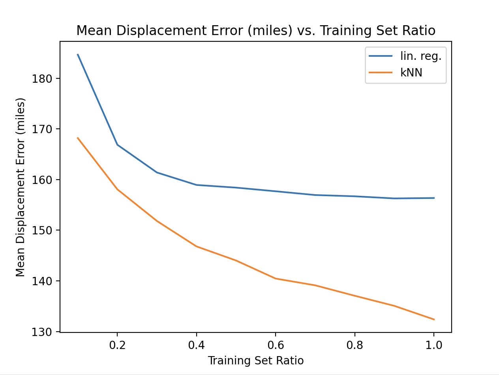

Homework #7: K-Clusters

3a Visualize Data
The two images from the PCA components offer important information about longitude. From the visible color gradient and spatial grouping in the PCA colored image, we can determine information of the longitude where similar longitudes represented by color cluster together. This also suggests that the embeddings encoude visual patterns correlating to geographical features and also potential clusters or outliers possibly corresponding to major cities or unique landscapes like mountainous ranges or the sea coast.

Train Data Count: 27616
3a graph 1: 
3a graph 2: 

3b 3 Nearest Neighbors

Test image: 53633239060.jpg
Nearest neighbor filenames: ['31870484468.jpg' '4554482343.jpg' '53643099910.jpg']
Coordinates of 3-NN:
Neighbor 1: Lat 37.3804, Lon -5.9943
Neighbor 2: Lat 40.0365, Lon -3.6092
Neighbor 3: Lat 37.3864, Lon -5.9924

3b graph: 

All 3 Neighbors are visually correct however their locations are far apart

3c Displacement Error
Naive baseline mean displacement error (miles: 209.9)

3d Grid Search for K no weight
3d graph: 

Based on the output and the graph of the grid search, it would seem as though k=3 yields the lowest mean displacement error at 132.4 miles.

output:
Running grid search for k (is_weighted=False)
1-NN mean displacement error (miles): 137.3
2-NN mean displacement error (miles): 133.0
3-NN mean displacement error (miles): 132.4
4-NN mean displacement error (miles): 133.5
5-NN mean displacement error (miles): 133.1
6-NN mean displacement error (miles): 135.1
7-NN mean displacement error (miles): 136.2
8-NN mean displacement error (miles): 136.6
9-NN mean displacement error (miles): 136.8
10-NN mean displacement error (miles): 138.1
20-NN mean displacement error (miles): 145.1
30-NN mean displacement error (miles): 149.5
40-NN mean displacement error (miles): 152.3
50-NN mean displacement error (miles): 154.6
100-NN mean displacement error (miles): 161.6

3e Explain Graph D
The most optimal method of explaining the plot and the results is by partioning the results and explaining specific behavior. 

k=1: With a low value of k, the bias is very low as the predictions are localized and follows the training data. With low bias, Variance becomes high as the model is sensitive to noise since its only looking at the closest point; underfitting. This results in a 137.3 mde which is a good start but contains noise.

k=3: The optimal value for k seems to be 3, with the lowest MDE of 132.4. The bias is still low as the predictions are only influenced by a few neighbors however the variance is reduced in comparison to k=1 since averaging across 3 neighbors stabilizes the results. 

k >= 10: As the values of k increase, the bias continues to increase with the model averaging over many possibly irrelevant neighbors and can no longer distinguish between fine lines. With Bias increasing, the variance decreases as the predictions become more stable but overly smooth; overfitting. The result it that the error increases significantly in parallel with k due to excess averaging.

3f Grid Search for K with weight
3f graph: 

Based on the output and the graph of the grid search, it would seem as though k=3 yields the lowest mean displacement error at 131.0 miles. However, the range at which stays at optimal range is far greater than graph 3d indicating that the weighted search is more effective than unweighted. Specifically, the optimal range around k=3 for unweighted had far more range of values wheras the optimal range around k=3 for weighted is much smaller and thus more accurate to our desired outcome.

Output
Running grid search for k (is_weighted=True)
1-NN mean displacement error (miles): 137.3
2-NN mean displacement error (miles): 131.9
3-NN mean displacement error (miles): 131.0
4-NN mean displacement error (miles): 131.9
5-NN mean displacement error (miles): 131.6
6-NN mean displacement error (miles): 133.5
7-NN mean displacement error (miles): 134.7
8-NN mean displacement error (miles): 135.1
9-NN mean displacement error (miles): 135.4
10-NN mean displacement error (miles): 136.6
20-NN mean displacement error (miles): 143.5
30-NN mean displacement error (miles): 148.0
40-NN mean displacement error (miles): 150.8
50-NN mean displacement error (miles): 153.1
100-NN mean displacement error (miles): 160.3

3g K-Nearest Neighbors vs Linear Regression
3g graph: 

Based on the output of data and it graphulated, k-nearest neighbors clearly outperforms linear regression at all training sets. While both models improve as more training data is added, k-nearest neighbbors improves far better with increasing training size while linear regression plateaus around 60%. At full datasets k-nearest neighbors ~ 130 mde as opposed to the linear regression ~155 mde, showing that k-nearest neighbors had the most effective results. If the data was doubled, I still believe that the k-nearest neighbors would far outperform linear regression, as even improving training data has only so much result on the linear regression while k-nearest neighbors continues to improve with more training data.

output
Training set ratio: 0.1 (2761)
Linear Regression mean displacement error (miles): 184.7
kNN mean displacement error (miles): 168.2

Training set ratio: 0.2 (5523)
Linear Regression mean displacement error (miles): 166.9
kNN mean displacement error (miles): 158.1

Training set ratio: 0.3 (8284)
Linear Regression mean displacement error (miles): 161.4
kNN mean displacement error (miles): 151.8

Training set ratio: 0.4 (11046)
Linear Regression mean displacement error (miles): 158.9
kNN mean displacement error (miles): 146.8

Training set ratio: 0.5 (13808)
Linear Regression mean displacement error (miles): 158.4
kNN mean displacement error (miles): 144.0

Training set ratio: 0.6 (16569)
Linear Regression mean displacement error (miles): 157.7
kNN mean displacement error (miles): 140.5

Training set ratio: 0.7 (19331)
Linear Regression mean displacement error (miles): 156.9
kNN mean displacement error (miles): 139.1

Training set ratio: 0.8 (22092)
Linear Regression mean displacement error (miles): 156.7
kNN mean displacement error (miles): 137.1

Training set ratio: 0.9 (24854)
Linear Regression mean displacement error (miles): 156.3
kNN mean displacement error (miles): 135.1

Training set ratio: 1.0 (27616)
Linear Regression mean displacement error (miles): 156.4
kNN mean displacement error (miles): 132.4
