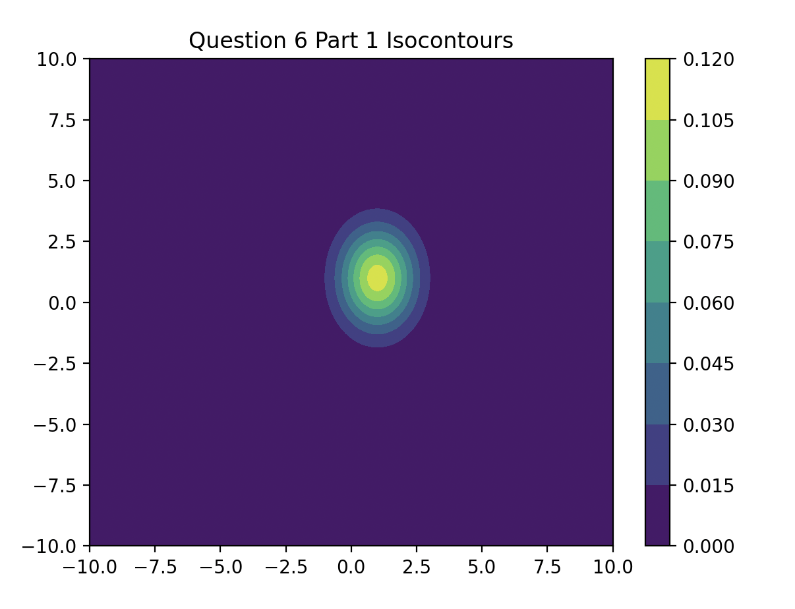
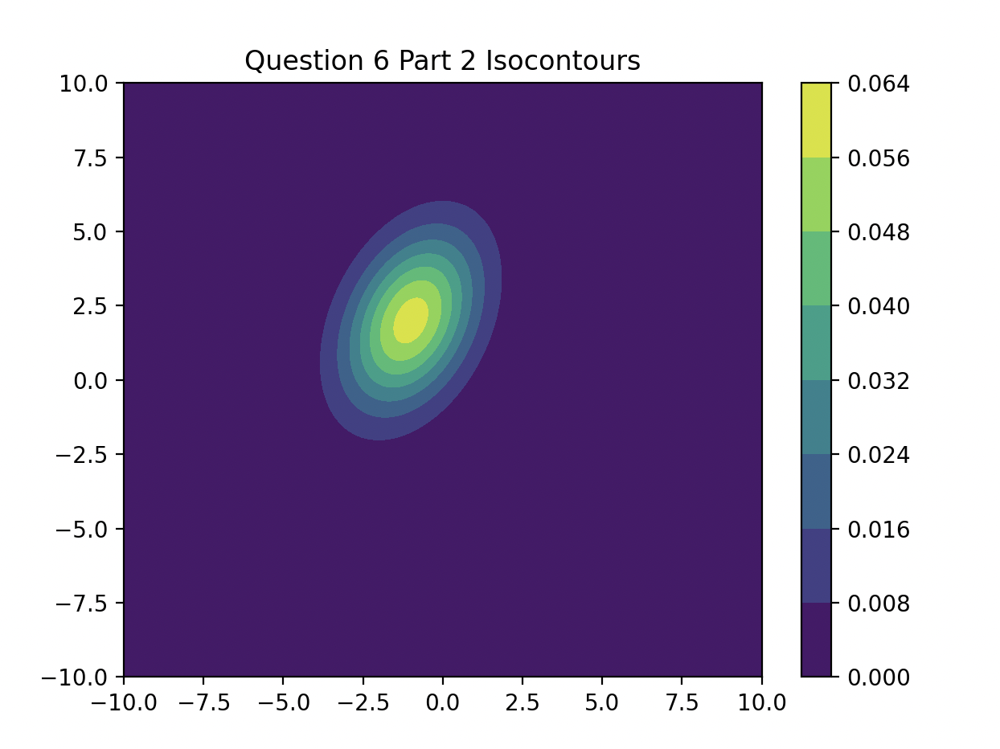
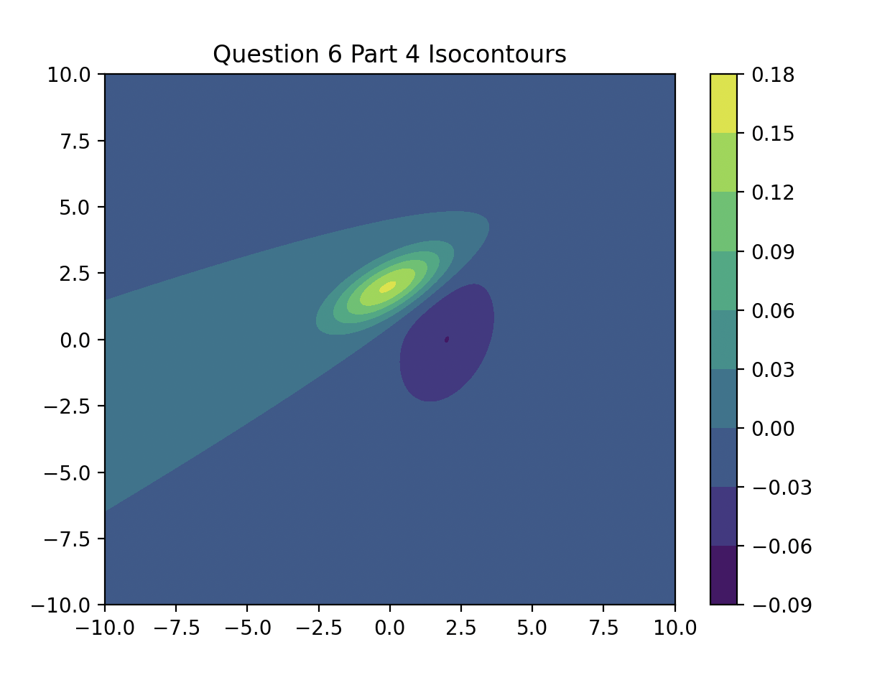
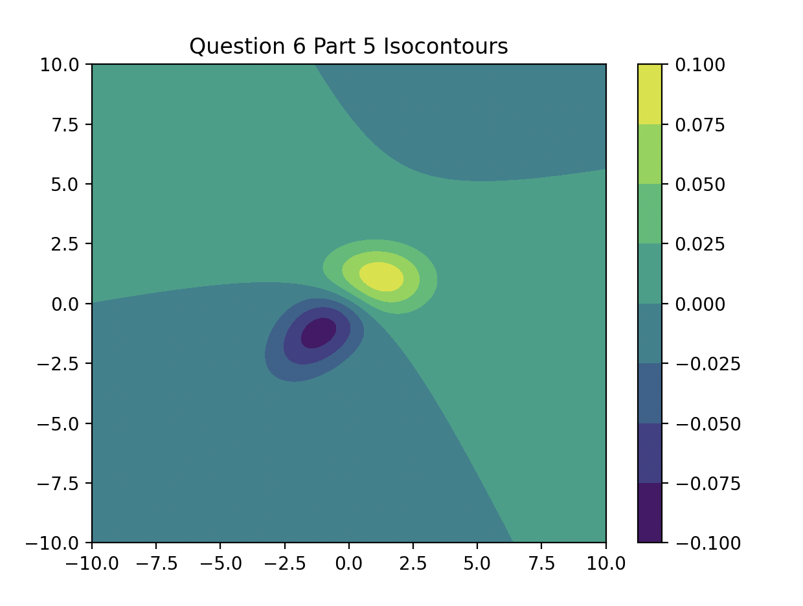
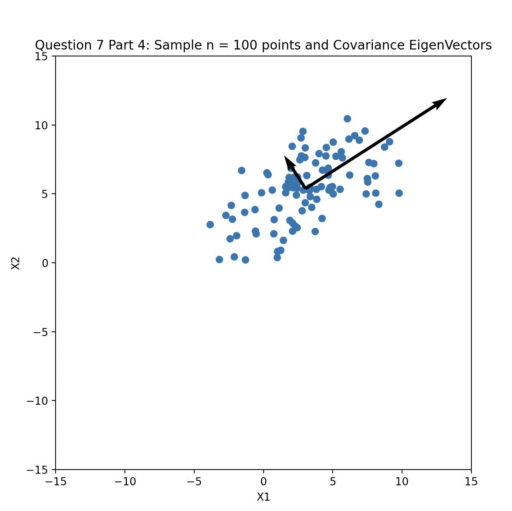
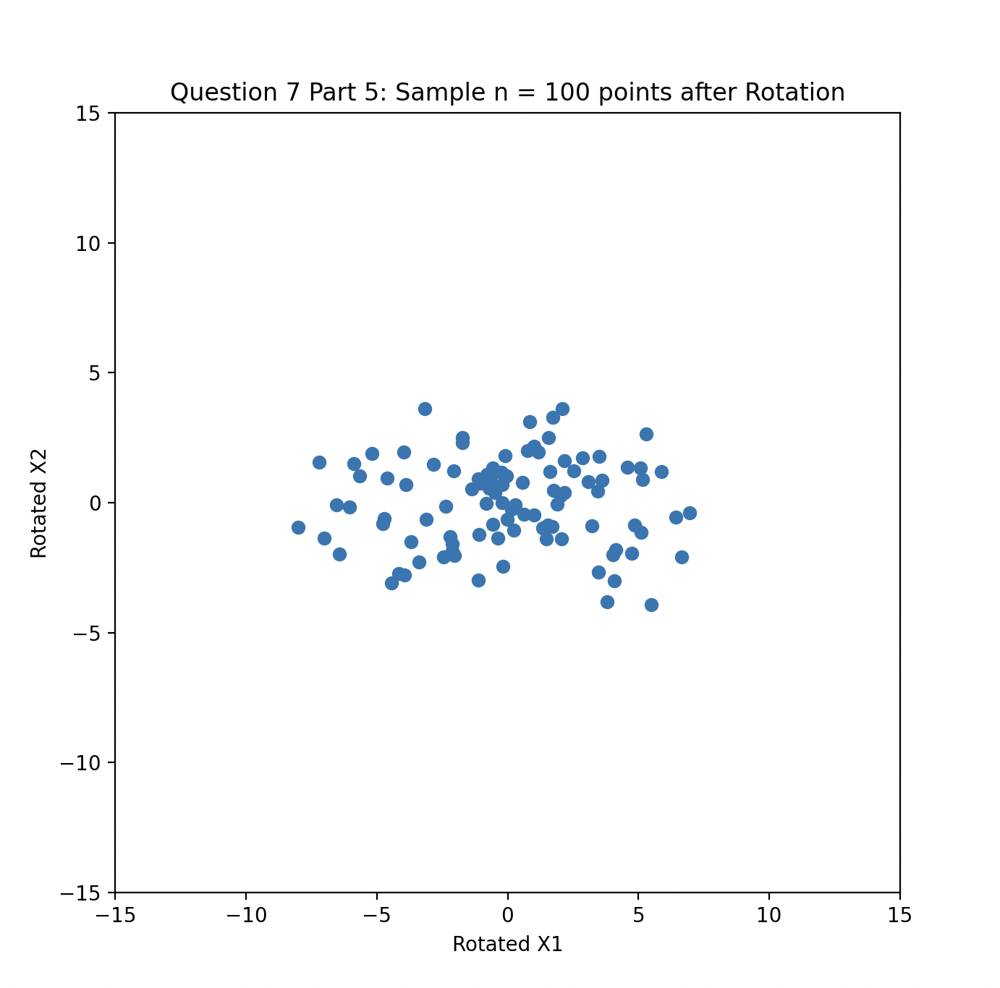
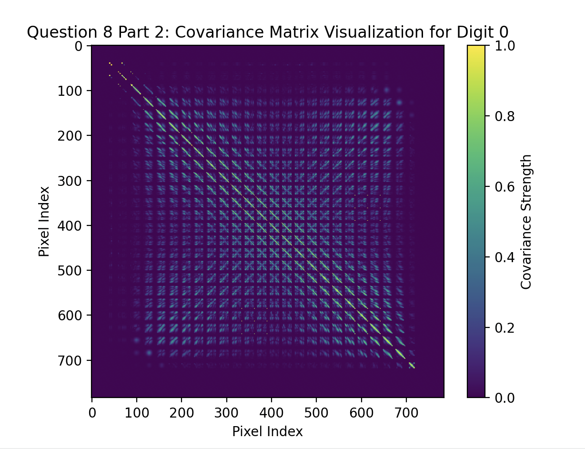
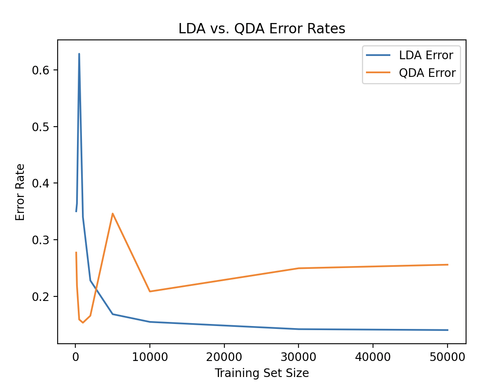
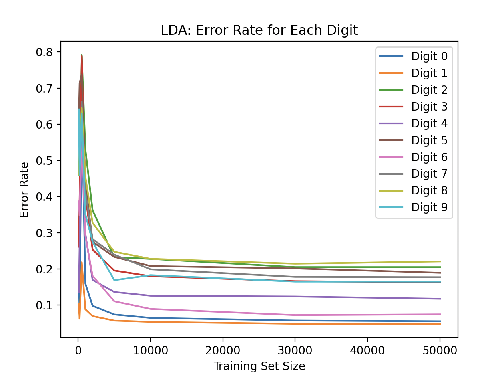

Homework #3 Code ReadMe:

Question 6: Isocontours of Normal Distributions:

Intro
To start, I wrote code to build a grid plot with 10 units left/right/up/down so that when
I need to create a plot, that this would already be ready for me to call for each part, as I knew none of the parts would extend past 10 units. In addition, I also put 500 points down as I thought that would be an appropriate number of move forward with in all the parts.

Part 1/2
For these parts, I wrote code to instantiate the u and epsilon for each individual part. After that, I simply used scipy's multivariate normal function to find the multivariate normal distribution with the parameters of each individual part. Then, I evaluated the Probability Density Function and created the isocontour plot using the found values

p1 graph: 
p2 graph: 

Part 3/4/5
For these parts, similarly, I did the same procedure to part 1/2 while also finding the multivariate distribution of the additional u and epsilon. After doing so, the question asked me to find the isocontours where the first one is subtracted by the second one. Thus, I followed those instructions and had my code create the isocontour plot for the desired values

p3 graph: 
p4 graph: 
p5 graph: 

Question 7: EigenVectors of Gaussian Covariance Matrix

Part 1/2/3
For these parts, I followed the instructions and instantiated the random samples that we used for the normal gaussian distribution. I first found X1 and using the formula for X2 found it as well. After doing so, I used the sample from X1 and X2 to calculate the sample mean, sample covariance and the corresponding eigen values and eigen vectors.

p1: Sample Mean in R squared is:  [3.03619627 5.38210861]

p2: Sample Covariance in R squared is:  [[9.43482057 4.22642979] [4.22642979 5.58826478]]

p3: The Eigenvalues for this sample covariance:  [12.15500115  2.8680842 ]
The Eigenvectors for this sample covariance:  [[ 0.84088966 -0.5412066 ] [ 0.5412066   0.84088966]]

Part 4/5
For these parts, I created the bounds and used the information from the previous parts to create a graph on a 2 dimensional grid with the following X1 as horizontal and X2 as vertical axis and graphed a 100 data points along with the eigen vectors for part 4. For part 5, I followed suit but followed the formulas and instructions on the rotation and graphed after

p4 graph: 
p5 graph: 

Question 8: Gaussian Classification for Digits and Spam

Part 1
For this part, I managed to filter the MNIST dataset to the training data and the labels. By proxy of the hint, I normalized the training data and found the unique labels from the MNIST dataset. After doing so, I build a function names MNIST training to aquire the (u, ep) for each unique label and put it into the trained list

Part 2
By proxy of my idx statement, I selected digit 0:

<!-- idx = (t_labels == t_labels_unique[0]).flatten()  --> line 50

Looking at the graph, I can visually see that the diagnol terms are generally increasing in covariance strength in comparison to the off-diagnol terms. This informs me that the correlation for neighboring pixels are greater than those that are far seperated.

p2 graph: 

Part 3

For part 3, I used the data partioning code that I created in Homework #1 for training and classification

Part A: LDA
As part of the GDA, I implemented LDA by modeling the class-condditional distributions as multivariate Gaussians. I assumed each class has a different mean but shares the same covariance matrix allowing for a linear decision boundry. I found the error rates by comparing the accuracy of how correct our model was able to classify and plotted the error rates along with the future QDA error rates.

Part B: QDA
As part of the GDA, I implemented QDA by modeling the class-condditional distributions as multivariate Gaussians. QDA allows each class to have its own covariance matrix, allowing for a quadratic decision boundary which is more flexible than the linear decision boundary from LDA. I found the error rates by comparing the accuracy of how correct our model was able to classify and plotted the error rates along with the aformentioned LDA error rates.

Part A/B Graphed results: p3-A/B graph: 

Part C: Analysis QDA vs LDA
Looking at both graphs for LDA and QDA error rates, while initially with smaller training size both QDA and LDA had relatively similar but unstable error rates, it seems to be that with higher training size and more certainty that follows with increasing training size that LDA seems to be the better GDA for this scenario.

As Mentioned in lecture, QDA tends to overfit with its flexible quadratic decision boundary while LDA tends to underfit with its linear decision boundary. Since LDA seems to perform better, I suspect that the data has a more linear Bayesian Decision Boundary which favors LDA for this scenario. 

In addition, while testing Kaggle using my two models, I found that LDA performs much better than QDA for both SPAM and MNIST

Honestly, I expected QDA to perform better than LDA for both SPAM and MNIST. However, it seems like the overfitting from my QDA class seems to outweigh the seemingly advantage of the quadratic decision boundary. 

Part D: LDA/QDA Classification per digit
Based on the GDA ran on MNIST data set, it would appear to me that digit 1 is most effective for LDA while Digit 0 is most effective for QDA. This informs me that digit 1 had more distinct features allowing for an easier seperation by a linear decision boundary for LDA. Digit 0 for QDA informs me that it has more of a flexible quadratic boundary helping the model classify digit 0. 

Part D Graphed results: p3-D LDA graph: 
Part D Graphed results: p3-D QDA graph: 

Part 4/5: Kaggle Submission
I used the same code as homework 1 to translate the predicted data into a csv file and submitted the results to Kaggle. These were my results:

*CSV files Labelled: 
MNIST: MNIST_Test_Labels.csv
SPAM: spam_Test_Labels.csv

Part 4: MNIST
LDA: p4 LDA graph: 
QDA: p4 QDA graph: 

Part 5: SPAM
LDA: p5 LDA graph: 
QDA: p5 QDA graph: 